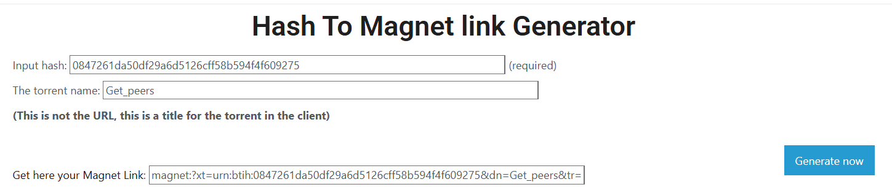
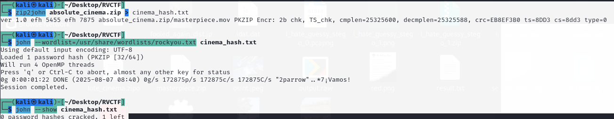

1. I opened the capture.pcapng file and analysed it using Wireshark. I noticed that there were several unusual requests such as `BT-DHT	146	Get_peers Info_hash=0847261da50df29a6d5126cff58b594f4f609275`. When I searched up what BT-DHT network protocol means, I obtained this" "The BitTorrent DHT (Distributed Hash Table) network is a decentralized system that allows BitTorrent users to find each other and the files they want to share without relying on a central tracker." I guessed that Get_peers was probably the name of a torrent file and "0847261da50df29a6d5126cff58b594f4f609275" was its hash. 

2. In order to get the link for the torrent, I went to https://www.hashtomagnet.com, a website that generates the magnet link of a torrent using its name and info hash. 

Magnet Link: magnet:?xt=urn:btih:0847261da50df29a6d5126cff58b594f4f609275&dn=Get_peers&tr=http%3A%2F%2F125.227.35.196%3A6969%2Fannounce&tr=http%3A%2F%2F210.244.71.25%3A6969%2Fannounce&tr=http%3A%2F%2F210.244.71.26%3A6969%2Fannounce&tr=http%3A%2F%2F213.159.215.198%3A6970%2Fannounce&tr=http%3A%2F%2F37.19.5.139%3A6969%2Fannounce&tr=http%3A%2F%2F37.19.5.155%3A6881%2Fannounce&tr=http%3A%2F%2F46.4.109.148%3A6969%2Fannounce&tr=http%3A%2F%2F87.248.186.252%3A8080%2Fannounce&tr=http%3A%2F%2Fasmlocator.ru%3A34000%2F1hfZS1k4jh%2Fannounce&tr=http%3A%2F%2Fbt.evrl.to%2Fannounce&tr=http%3A%2F%2Fbt.rutracker.org%2Fann&tr=https%3A%2F%2Fwww.artikelplanet.nl&tr=http%3A%2F%2Fmgtracker.org%3A6969%2Fannounce&tr=http%3A%2F%2Fpubt.net%3A2710%2Fannounce&tr=http%3A%2F%2Ftracker.baravik.org%3A6970%2Fannounce&tr=http%3A%2F%2Ftracker.dler.org%3A6969%2Fannounce&tr=http%3A%2F%2Ftracker.filetracker.pl%3A8089%2Fannounce&tr=http%3A%2F%2Ftracker.grepler.com%3A6969%2Fannounce&tr=http%3A%2F%2Ftracker.mg64.net%3A6881%2Fannounce&tr=http%3A%2F%2Ftracker.tiny-vps.com%3A6969%2Fannounce&tr=http%3A%2F%2Ftracker.torrentyorg.pl%2Fannounce&tr=https%3A%2F%2Finternet.sitelio.me%2F&tr=https%3A%2F%2Fcomputer1.sitelio.me%2F&tr=udp%3A%2F%2F168.235.67.63%3A6969&tr=udp%3A%2F%2F182.176.139.129%3A6969&tr=udp%3A%2F%2F37.19.5.155%3A2710&tr=udp%3A%2F%2F46.148.18.250%3A2710&tr=udp%3A%2F%2F46.4.109.148%3A6969&tr=udp%3A%2F%2Fcomputerbedrijven.bestelinks.nl%2F&tr=udp%3A%2F%2Fcomputerbedrijven.startsuper.nl%2F&tr=udp%3A%2F%2Fcomputershop.goedbegin.nl%2F&tr=udp%3A%2F%2Fc3t.org&tr=udp%3A%2F%2Fallerhandelenlaag.nl&tr=udp%3A%2F%2Ftracker.openbittorrent.com%3A80&tr=udp%3A%2F%2Ftracker.opentrackr.org%3A1337&tr=udp%3A%2F%2Ftracker.publicbt.com%3A80&tr=udp%3A%2F%2Ftracker.tiny-vps.com%3A6969 

3. Then, I downloaded a BitTorrent client from https://transmissionbt.com. After downloading the torrent, I got a password-protected file absolute_cinema.zip that contained a file called masterpiece.mov.

4. I tried cracking the password of absolute_cinema.zip using John The Ripper and the default wordlist rockyou.txt, but it didn't work.

5. Then, I tried using another password cracker, hashcat: