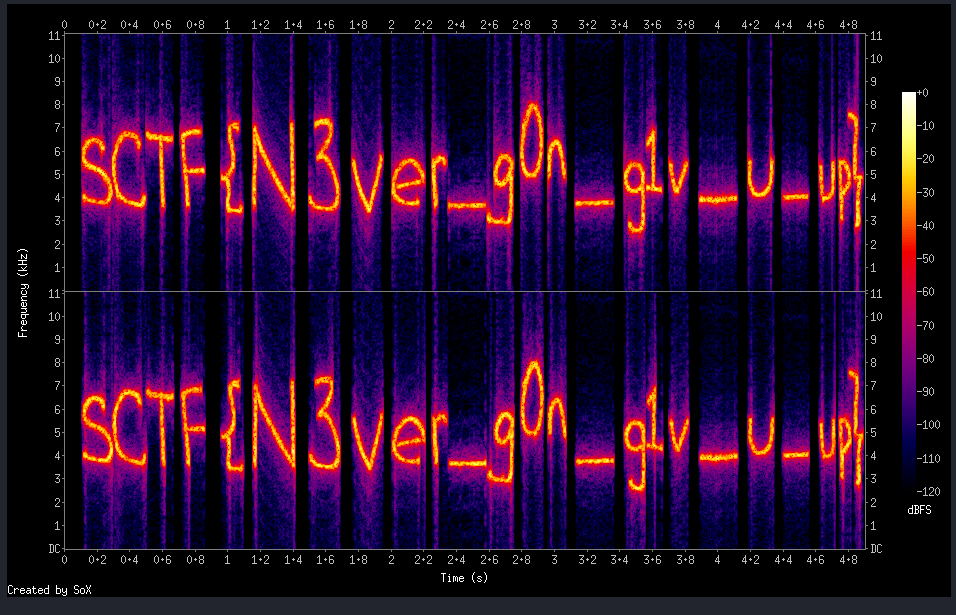

1. I opened the birds.wav file in Kali Linux and tried to obtain a spectrogram from it, as it is common for challenges involving audio .wav files to hide flags in the spectrogram. I used `sox birds.wav -n spectrogram -o spectrogram.png`. 

2. Then, I opened up spectrogram.png and obtained the flag:

The flag is SCTF{N3ver_g0n_g1v_u_up}.